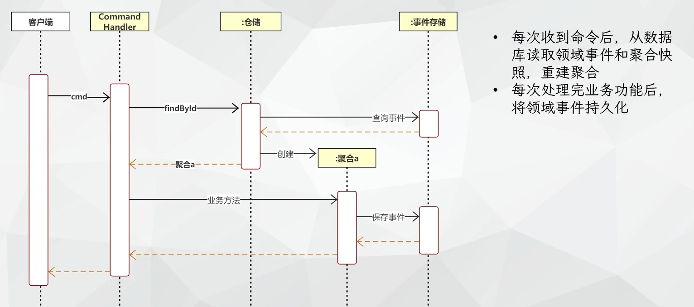
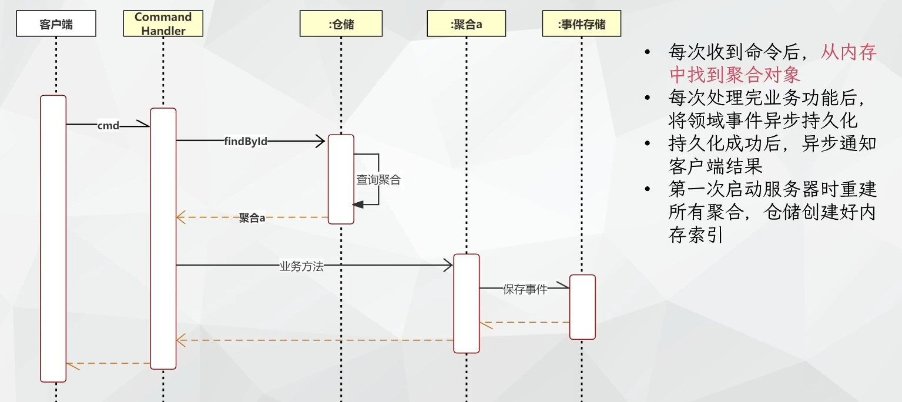

# LMAX 架构

[视频链接](https://www.bilibili.com/video/BV14v42117yT)

- Martin Forwler 2005 年
  - <https://martinfowler.com/articles/lmax.html>
- LMAX 起源
  - 金融零售平台，要求高性能
  - 达到单线程 600 万 TPS
  - 以这个交易平台的名字命名这种架构
- LMAX 架构目标
  - 超高 TPS

## LMAX 架构要素

- 聚合常驻内存
- 事件溯源
- 单线程异步非阻塞 IO（串行化，无锁）

## 时序对比

### 传统时序


### 事件溯源时序



### LMAX 时序



## 内存化的仓储实现示例

```kt
class SomeRepository {
    private val idIndex: MutableMap<String, SomeAgg> = HashMap()
} {
    fun findById(id: String): SomeAgg? = idIndex[id]
    fun save(someAgg: SomeAgg) {
        this.idIndex[someAgg.id] = someAgg
    }
}

class SomeFactory {
    private val someRepository: SomeRepository
} {
    fun createSomeAgg(createAggCmd: CreateAggCmd) {
        val newSomeAgg = SomeAgg()
        this.someRepository.save(newSomeAgg)
        return newSomeAgg
    }
}
```

## 单线程非阻塞异步 IO（reactor）

- 多线程：
  - CPU 在多线程间切换开销高（相对于 reactor）
  - 阻塞
    - 每个请求一个线程，并发受线程数限制
  - 非阻塞
    - 聚合在内存中只有一个实例，对实例加锁，每个聚合实际并发 1
- 单线程
  - 串行执行，无需加锁，一个 CPU 执行一个线程
  - 阻塞
    - 并发能力 1，性能暴跌
  - 非阻塞（超高性能的唯一选择）

## 配合事件溯源

- 只持久化领域事件，带来高性能写
- 确保重启服务器时，可从领域事件重建聚合

## 高可用方案

<mermaid>
graph TD
网关 --> main
main --领域事件--> A( )
A --> follower1
A --> follower2
supervisor ---- 网关
supervisor ---- main
supervisor ---- follower1
supervisor ---- follower2
</mermaid>

## LMAX 代价

- 无数据库事务
  - 无先操作后回滚，必须严格前置完成所有校验，才能变更聚合内的状态数据，才能发布领域事件
- 运行时外部调用变复杂
  - 减少主动外部调用：监听事件提前组装数据（数据量小）
  - 显式事件驱动方式
- 受内存大小限制
  - 聚合实例数据量太大：数据分区，多服务器，架构更复杂

## LMAX-总结

### 优缺点

- 优点
  - 极致性能
  - 全内存化模型设计，更灵活自由
- 缺点
  - 异步编程带来的编程难度
  - 高可用架构更复杂

### 适用范围

- 聚合数据量适合内存化，需要极致 TPS 场景，比如：
  - 某些游戏服务器
  - 火车订票
