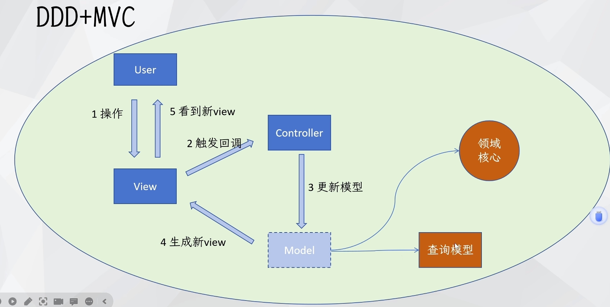

# DDD 与 MVC

[视频链接](https://www.bilibili.com/video/BV1F6421u7KF){target="\_blank"}

## 介绍

DDD 与 MVC

- 两者之间**没有关系**
- 分别处理不同的问题
  - MVC 解决的是 UI 问题
  - DDD 解决的是业务逻辑问题

### MVC

<mermaid>
graph TD
User --1操作--> View
View --2触发回调-->  Controller
Controller --3更新模型--> Model
Model --4生成新View--> View
View --5看到新View--> User
</mermaid>

- Model 的职责
  - 持有 View 渲染时需要的数据
  - 完成业务功能
- View 的职责
  - 生成界面给用户查看
  - 翻译用户操作为系统动作
- Controller
  - 翻译用户操作为模型动作

### 六边形架构

<mermaid>
graph LR
subgraph 非领域代码
领域核心模块((领域核心模块))
end
</mermaid>

## DDD + MVC

- 有领域核心模块，有 MVC，Model 由领域模型承担
- 典型的架构
  - JSP + Servlet + EJB
  - JSP + Struts + Spring Bean
  - JSP + EJB
  - FreeMarker/Thymeleaf/Velocity + SpringMVC + Spring Bean

## DDD 无 MVC

- 没有 MVC，只有对外接口，接受外部请求
- 处理请求被翻译成执行领域命令，由领域核心
- 在前端大发展之后（Ajax React Vue）MVC 在服务端就逐渐不流行了

## MVC 无 DDD

- 有 MVC
- Model 不使用领域模型，没有领域核心模块
- Model 直接翻译成数据库操作

## 反例：既没有 DDD 也没有 MVC

事务脚本大泥球

<mermaid>
graph TD
subgraph 服务端
Controller --> Service
Service --> Dao
Dao --> Service
Service --> Controller
end
Client --> Controller
Controller --> Client
</mermaid>

- ~~“我们没有用 DDD，我们用的是 MVC。”~~
- “我们没有用 DDD，我们用的是事务脚本大泥球。”
