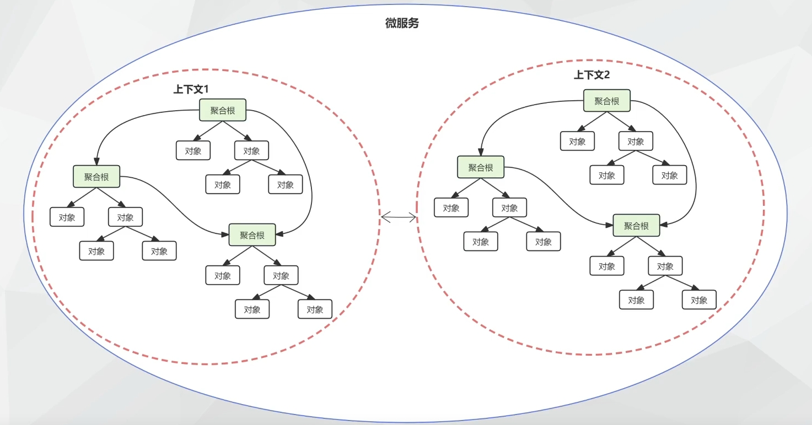
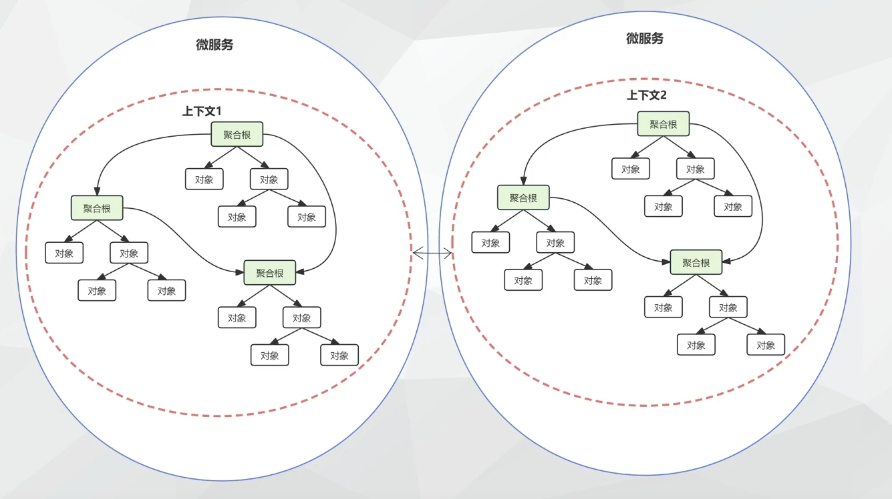
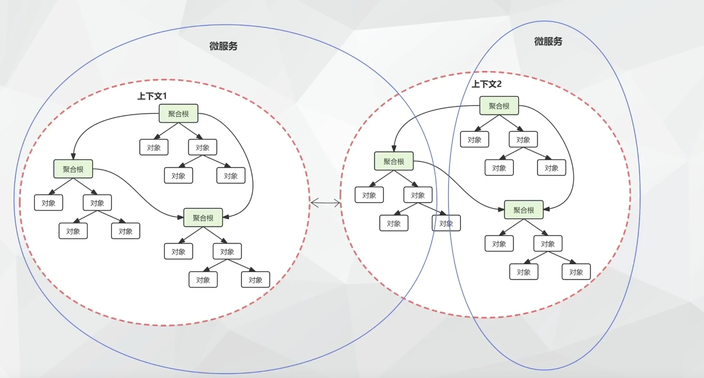

# DDD 与微服务

[视频链接](https://www.bilibili.com/video/BV1wA4m1G7a8)

## DDD 与微服务的关系

- DDD 可以用微服务实现，也可以不用微服务
- DDD 是微服务拆分的必须参考项之一
  - 不能将同一个上下文的功能分拆到不同的服务中，否则形成分布式大泥球
- 微服务拆分还需要参考别的因素
  - 伸缩性边界
  - 团队结构
  - 遗留系统

## 微服务和限界上下文

### 例 1

### 例 2

### 反例：分布式大泥球

