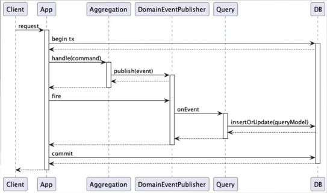
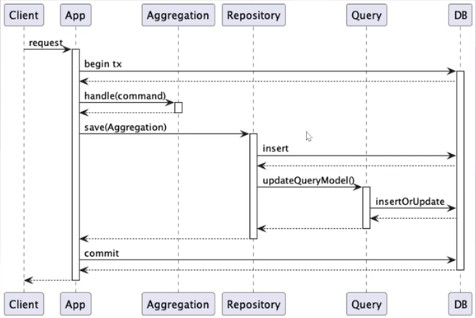

# DDD 与 CQRS

[视频链接](https://www.bilibili.com/video/BV1Sa4y1U7TR)

- C：Command and 命令和
- Q：Query 查询
- R：Responsibility 职责
- S：Segreation 分离

## 命令和查询

- 把软件系统功能拆解成命令和查询两类
  - 命令：有副作用，会导致系统发生变更
  - 查询：没有副作用，不会导致系统发生变更

### 职责分离

<mermaid>
graph TD
查询模块 --依赖--> 命令模块
</mermaid>

- 在架构上，把命令和查询两类功能代码分离
  - 一般查询，模块依赖命令模块
  - 查询模块负责生成查询数据
  - 查询模块和命令模块的数据在存储上可以共享，也可以分离，甚至异构
  - 应对高性能查询和复杂查询
  - 不使用 DDD 也可以使用 CQRS

## DDD 的 CQRS

- 命令模块用 DDD 实现，查询模块不用 DDD 实现

  - 降低领域模型设计难度，同时适配命令和查询两类业务

- 命令场景的领域模型

  - 对象少
  - 对象间形成树形或图结构
  - 避免冗余数据
  - ACID 很重要

- 查询场景的查询模型
  - 对象多
  - 对象间只有查询用的关联关系
  - 大量冗余为了提升性能
  - ACID 不重要

### 架构方案一：标准架构

<mermaid>
graph TD
UI --命令--> 命令模块领域模型
UI --查询--> 查询模块查询模型
命令模块领域模型 --发布--> 领域事件
领域事件 --监听--> 查询模块查询模型
</mermaid>

- 命令和查询通过领域事件集成
  - 命令模块（领域模块）发布领域事件，查询模块监听领域事件，构建查询模型，提供查询功能
- 采用异步的消息队列的方式
- 存储分开，领域模型和查询模型用各自合适的格式存储到各自的存储设备中

- 注意
  - 消息的顺序消费
  - 消息的可靠送达（有且仅有一次）
  - 查询模型存储和领域模型存储的延迟

#### 领域事件

- 领域事件是一种领域模型
  - 代表领域中已发生的确定的有意义事件
  - 不可变
  - 按时间有序

### 架构方案二：同事务存储分离

- 命令和查询数据的构建在一个事务中
- 优点：简单，没有消息消费引发的问题（顺序、可靠、延迟）
- 缺点
  - 领域模型和查询模型存储到同一数据库
  - 命令处理延迟更高

### 架构方案三：共享存储

- 由仓储负责触发生成查询模型
- 优点：简单易实现
- 缺点
  - 查询模型共享领域模型
  - 适应范围窄

## 什么时候采用 CQRS？

不用 CQRS 就会污染领域模型的时候

- 复杂查询
  - 条件复杂，需要冗余数据
  - 搜索
- 高性能查询

  - 需要查询专用数据库
  - 异构查询存储（关系型数据库 + 缓存 + NoSQL）

- **只要领域复杂点，一般都要 CQRS**

## 采用 CQRS 的哪种架构方案？

- **从简单做起，能落地能解决问题最重要！**

<mermaid>
graph LR
同事务同表 --> 同事务不同表
同事务不同表 --> 消息集成不同数据库
</mermaid>
