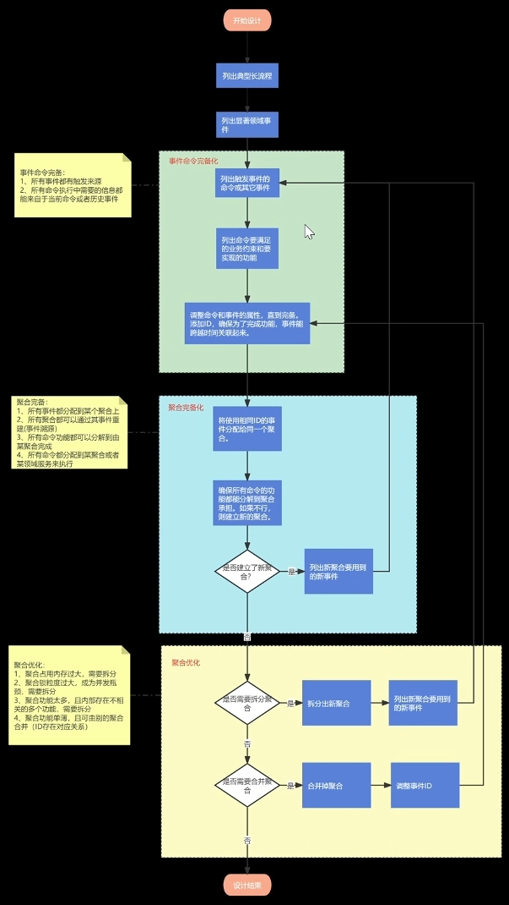

# 事件风暴

[视频链接 1](https://www.bilibili.com/video/BV1Ma4y1d7ea)
[视频链接 2](https://www.bilibili.com/video/BV1664y1G79b)

- Alberto Brandolini 发明的一种头脑风暴的方法，可以：
  - 分析交流学习领域知识
  - 梳理业务流程，理解系统职责
  - 进一步设计领域模型

## 对于事件风暴的改进

{width=100%}
