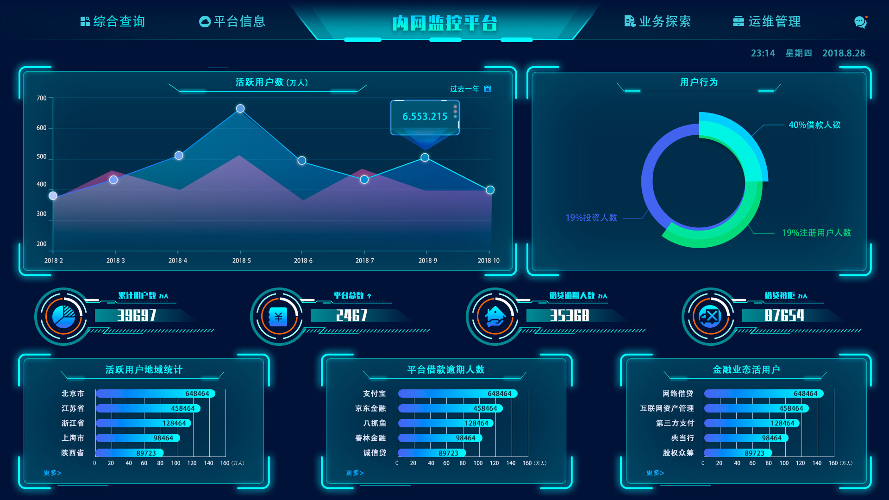

# 政府项目

## 中国保密在线-保密书城

[`ThinkPHP`](https://www.thinkphp.cn/)
[`HTML`](https://developer.mozilla.org/zh-CN/docs/Web/HTML)
[`CSS`](https://developer.mozilla.org/zh-CN/docs/Web/CSS)

{width="50%"}

手机端：微信“保密观”公众号

### 负责开发

## 中国保密在线-保密观公众号建设

[`NodeJS`](https://nodejs.org/)
[`Vue2`](https://v2.vuejs.org/)
[`RabbitMQ`](https://www.rabbitmq.com/)

手机端：微信“保密观”公众号

## 中国保密在线-保密书城、保密学堂建设

[`Apache OFBiz`](https://ofbiz.apache.org/)
[`JSP`](https://www.ibm.com/docs/zh-tw/was-zos/9.0.5?topic=applications-javaserver-pages)

<i class="pi pi-globe"></i>
[官网地址](https://www.baomi.org.cn/?pageId=1&index=0&siteId=95)

- pc 端为一个很有年代感的 Apache OFBiz 电商项目
- 对一个 15 年前的系统进行优化与二次开发，拓展已有业务
- 建设微信公众号

## 山东省版权管理平台-项目迭代、运维

[`Apache OFBiz`](https://ofbiz.apache.org/)
[`Solr`](https://solr.apache.org/)
[`FreeMarker`](https://freemarker.apache.org/)

<i class="pi pi-globe"></i>
[官网地址](https://sdbqfw.com)

## “锁脸”人脸识别系统

[`SpringMVC`](https://docs.spring.io/spring-framework/docs/3.2.x/spring-framework-reference/html/mvc.html)
[`JSP`](https://www.ibm.com/docs/zh-tw/was-zos/9.0.5?topic=applications-javaserver-pages)
[`MongoDB`](https://www.mongodb.com/)
[`Netty`](https://netty.io/)
[`JQuery`](https://jquery.com/)

- 某省公安部门用于实时监控的人脸识别系统
- 在逃人员人脸特征库实时比对、告警
- 通过 netty 进行 nio 通信，对接算法组

### “锁脸”人脸识别系统-负责内容

- 存储
- 通过 Netty 与硬件组进行通信

## 内网监控平台

[`SpringBoot`](https://spring.io/projects/spring-boot)
[`Hadoop`](https://hadoop.apache.org/)
[`JQuery`](https://jquery.com/)
[`Layui`](https://layui.dev/)

- 完成前端

### 内网监控平台-负责内容

- 前端
