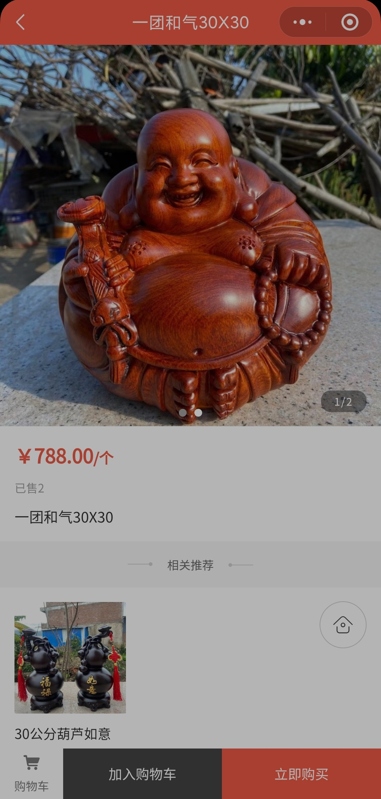
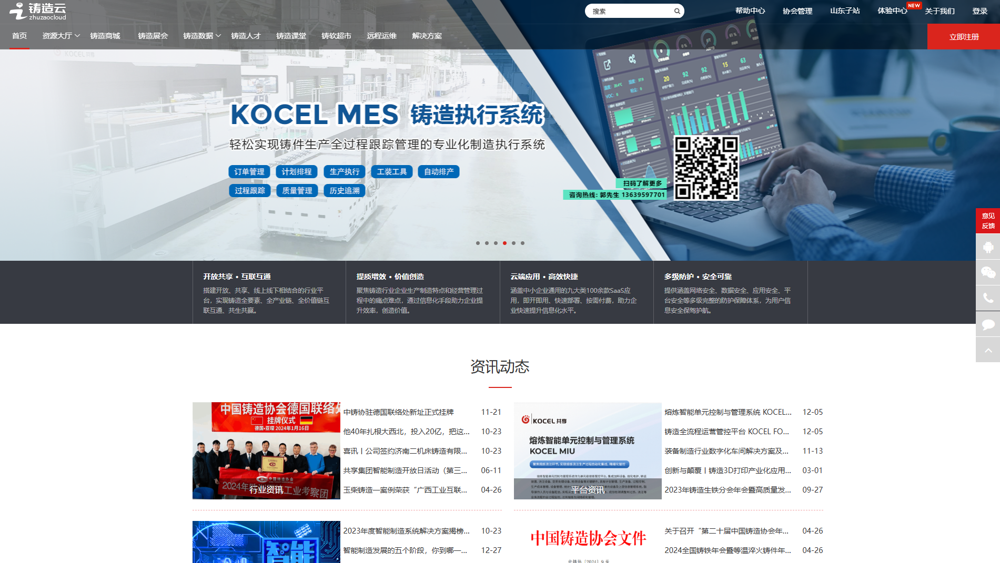
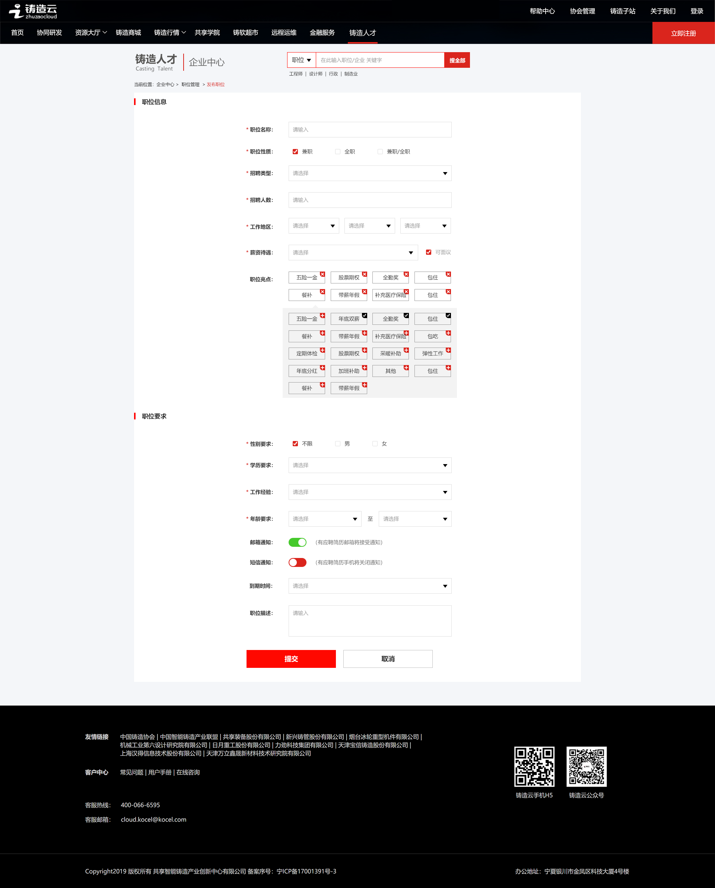

# 企业项目

## 长虹佳华项目管理系统

[`SpringBoot`](https://spring.io/projects/spring-boot)
[`Vue3`](https://vuejs.org/)
[`Activiti`](https://www.activiti.org/)

<i class="pi pi-globe"></i>
[官网地址](http://xmgl.changhongit.cn)

- 长虹嘉华内部项目管理系统。典型的交互不多但流程长的场景，核心业务为项目报备，库存分配，合同审批、合同模板管理、合同打印

### 长虹佳华项目管理系统-负责内容

- 复杂多变的审批流，可能每过几个星期就要根据实际需求调整 是否经过某一节点审批
  - 为此设计了一个“中文脚本”

## 木雕 APP

[`React Native`](https://reactnative.dev/)
[`SpringBoot`](https://spring.io/projects/spring-boot)
[`Redis`](https://redis.io/)
[`Redisson`](https://redisson.pro/)

{width="50%"}

- b2c 商城
- 采用
- 好物推荐

### 木雕 APP-负责内容

- 后端
  - 订单模块
  - 库存模块

## 铸造云-人才系统

[`SpringBoot`](https://spring.io/projects/spring-boot)
[`Lucene`](https://lucene.apache.org/)
[`Vue3`](https://vuejs.org/)
[`SSO`](https://www.ibm.com/cn-zh/topics/single-sign-on)
[`WebSocket`](https://developer.mozilla.org/zh-CN/docs/Web/API/WebSockets_API)
[`Layui`](https://layui.dev/)

{width="50%"}
{width="50%"}

<i class="pi pi-globe"></i>
[官网地址](https://job.zhuzaocloud.com/)

- 助力传统制造业的企业进行职位发布、人才库管理等。
- 同时对应聘者提供方便快捷的信息建档、建立投递、在线沟通等服务

### 铸造云-人才系统-负责内容

- 全栈
